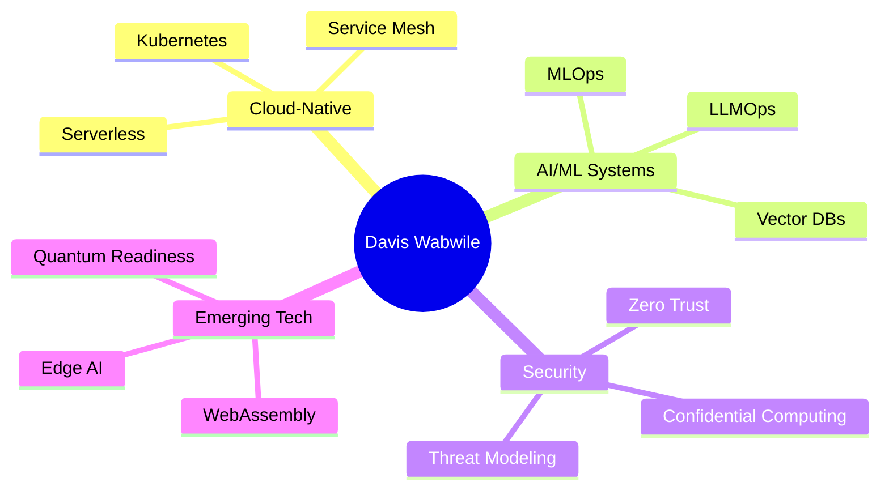

#  Dave Wabwile <p align="center">
  
</p>


##  Cloud-Native Engineer, Fullstack Developer & AI Solutions Architect
**Multi-Cloud Specialist** | **Distributed Systems Expert** | **MLOps Engineer** | **Security Champion**

[](https://github.com/Alphadavethedon)
[](https://github.com/Alphadavethedon?tab=repositories)
[](https://github.com/Alphadavethedon)


---

##  Next-Gen Tech Profile
**Polyglot engineer** specializing in **cloud-native architectures**, **AI/ML systems**, and **secure distributed applications**. Passionate about building **scalable, resilient systems** with **observability-first** approaches and **GitOps workflows**.



---

## 🛠️ Ultra-Modern Tech Stack

### 🔮 Next-Level Development
<p>
   
  
  
  
  
</p>

### ☁️ Cloud-Native Ecosystem
<p>
  
  
  
  
  
</p>

### 🤖 AI/ML Frontier
<p>
  
  
  
  
  
</p>

### 🔐 Security First
<p>
  
  
  
  
</p>

---

## 🏆 Certifications & Achievements

### ☁️ Cloud Certifications
<p>
  
  
  
  
</p>

### 🔒 Security Credentials
<p>
  
  
  
</p>

### 🧠 AI/ML Certifications
<p>
  
  
  
</p>

---

## 📊 GitHub Analytics

<div align="center">
  
[](https://git.io/streak-stats)

[](https://github.com/anuraghazra/github-readme-stats)

[](https://github.com/ashutosh00710/github-readme-activity-graph)

</div>

---
### [Mobile Money Fraud Detection Real-Time Data Pipeline](https://github.com/Alphadavethedon/Mobile-Money-Fraud-Detection-Real-Time-Data-Pipeline)
An end-to-end real-time fraud detection pipeline simulating M-Pesa-like transactions using Kafka, Spark, Airflow, MLflow, and Streamlit.

### [E-commerce Database Design](https://github.com/Alphadavethedon/E-commerce-database-design)
A scalable and normalized relational database schema for an e-commerce platform, complete with ERDs and SQL scripts for deployment.

### [Road Traffic Accidents EDA Case Study](https://github.com/Alphadavethedon/Road-Traffic-Accidents-EDA/blob/main/Exploratory_Data_Analysis_(EDA)_Case_Study_Road_Traffic_Accidents.ipynb)
A comprehensive exploratory data analysis of road traffic accidents using Pandas, Seaborn, and Matplotlib to uncover trends and correlations.

### [Distributed Task Orchestrator](https://github.com/Alphadavethedon/task-orchestrator)
Scalable task queue built with Redis, Go, and Kubernetes to enable distributed, fault-tolerant workflow orchestration.

### [Cloud Cost Optimizer](https://github.com/Alphadavethedon/cloud-optimizer)
AI-powered toolkit that applies ML and real-time analytics to reduce multi-cloud infrastructure costs.

### [Zero Trust Proxy](https://github.com/Alphadavethedon/zero-trust-proxy)
A security proxy inspired by Google's BeyondCorp, integrated with Keycloak and Istio to enforce Zero Trust principles.

### [AI-Driven Log Analyzer](https://github.com/Alphadavethedon/log-analyzer)
Log analysis tool that uses NLP (Hugging Face transformers) and Elasticsearch to extract insights from large-scale logs.


---

## 📝 Latest Blog Posts
<!-- BLOG-POST-LIST:START -->
- [Building Quantum-Resistant Cryptography in Go](https://medium.com/@davewabwile)
- [MLOps at Scale with Kubeflow 2.0](https://medium.com/@davewabwile)
- [Zero Trust Architectures for Kubernetes](https://medium.com/@davewabwile)
<!-- BLOG-POST-LIST:END -->

---

## 🤝 Let's Connect
<p align="center">
  <a href="https://linkedin.com/in/daviswabwile">
    
  </a>
  <a href="https://twitter.com/Alphadavethedon">
    
  </a>
  <a href="mailto:davewabwile@gmail.com">
    
  </a>
  <a href="https://alphadavethedon.github.io/Davis-portfolio/">
    
  </a>
</p>

---

## 🌟 Visitor Counter


⭐ From [Alphadavethedon](https://github.com/Alphadavethedon)
```
