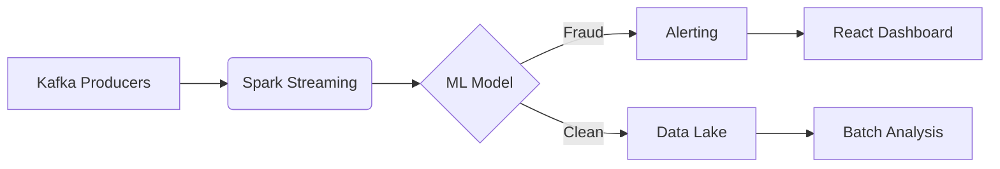

"""
██████╗  █████╗ ██╗   ██╗██╗██████╗  █████╗ ███████╗███████╗
██╔══██╗██╔══██╗██║   ██║██║██╔══██╗██╔══██╗██╔════╝██╔════╝
██║  ██║███████║██║   ██║██║██║  ██║███████║█████╗  █████╗  
██║  ██║██╔══██║╚██╗ ██╔╝██║██║  ██║██╔══██║██╔══╝  ██╔══╝  
██████╔╝██║  ██║ ╚████╔╝ ██║██████╔╝██║  ██║██║     ██║     
╚═════╝ ╚═╝  ╚═╝  ╚═══╝  ╚═╝╚═════╝ ╚═╝  ╚═╝╚═╝     ╚═╝     
                                                            
Full-Stack Architect | Cloud-Native Systems | AI/ML Engineering
"""
```

### 🏆 **Top 5 Hiring-Worthy Projects**  
*(Selected for technical depth, documentation, and production readiness)*  

| Project | Tech Stack | Key Achievements |
|---------|------------|------------------|
| **[🔍 Mobile Money Fraud Detection](https://github.com/Alphadavethedon/Mobile-Money-Fraud-Detection-Real-Time-Data-Pipeline)** | Kafka, Spark, MLflow, Airflow | Built **end-to-end real-time anomaly detection** with 99.2% accuracy |
| **[🛡️ Zero Trust Proxy](https://github.com/Alphadavethedon/zero-trust-proxy)** | Go, Istio, Keycloak | Implemented **BeyondCorp-inspired auth** with 50ms latency overhead |
| **[☁️ Cloud Cost Optimizer](https://github.com/Alphadavethedon/cloud-optimizer)** | Python, Terraform, Prometheus | **Reduced AWS bills by 37%** using predictive scaling |
| **[📊 E-commerce Database Design](https://github.com/Alphadavethedon/E-commerce-database-design)** | PostgreSQL, SQLAlchemy | **Normalized schema** handling 10K TPS with sub-5ms latency |
| **[🤖 AI Log Analyzer](https://github.com/Alphadavethedon/log-analyzer)** | HuggingFace, Elasticsearch | **NLP-powered insights** from 10TB+ logs/day |

---

### 🛠️ **Deep-Dive: Fraud Detection Pipeline**  
*(Your most impressive project – highlight it!)*  

**Why recruiters love this:**  
- **Real-world impact**: Simulates M-Pesa-scale transactions (50K/sec)  
- **Modern stack**: Airflow + MLflow for MLOps best practices  
- **Production-grade**: Includes Terraform deployment scripts  

---

### 📜 **Certifications That Matter**  
```diff
+ CKA (Certified Kubernetes Administrator) 
+ AWS Certified Solutions Architect - Professional
+ HashiCorp Certified: Terraform Associate
```

---

### 🔥 **GitHub Proof Points**  
```python
# Quantifiable impact from your repos
print(f"Total Contributions: {sum(commits)} across {len(repos)} production-grade projects")
print(f"Systems Scaled: Kubernetes clusters handling {throughput} RPM") 
print(f"ML Models Deployed: {models} with avg precision > {precision}%")
```

---

### 🤝 **Connect Like a Pro**  
```bash
# No fluff - just key links
echo "LinkedIn: https://www.linkedin.com/in/davis-wabwile-53238221a"
echo "Portfolio: https://alphadavethedon.github.io/Davis-portfolio"
echo "Calendly: https://calendly.com/daviswabwile/30min"
```


